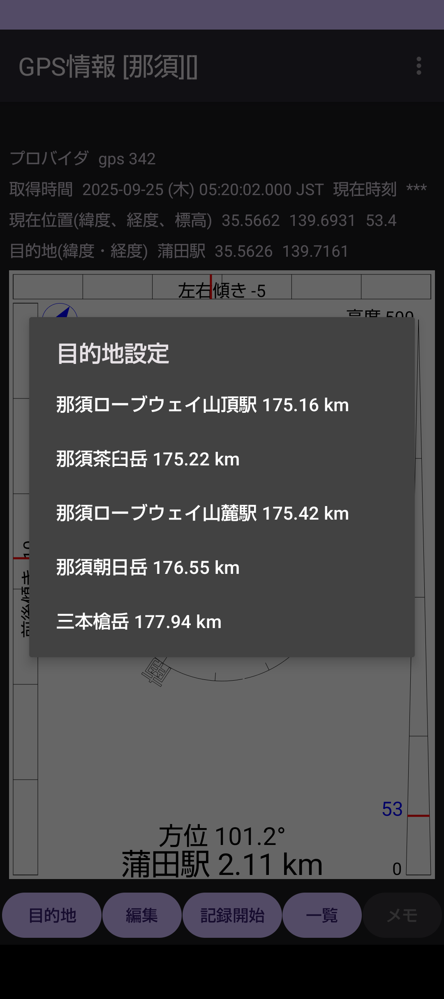

## GpsInfo - GPS情報表示

旧版のGpsInfo2がAndroid 14で動作しなくなったため、Android Studio Narwhalで再作成。  
大きな変更はGPXファイルを共通ストレージ(/strage/emulated/0/DCIM/gpsinfo)に変更、あと細かいところを修正。  

### 機能
・GPSによる位置の取得  
・目的地の方向と距離  
・加速度センサーによる本体の傾き  
・GPSロガー  
・GPSロガーデータの一覧とリストデータのグラフ表示  
・GPSロガーデータのグラフ表示  

##### ※GPSロガー : GPSからの位置情報を記録したものでその間の経路や距離、時間、高度、速度が求められる

### 起動画面

**タイトルバー** : グループ名と記録中のGPXファイル名が表示される  
**目的地ボタン** : 目的地をリスト表示、選択した目的地の方向と距離を表示  
**目的地ボタン長押し** : 目的地のグループをリスト表示、選択したグループの目的地リストに変更する  
**編集ボタン** : 目的地データの追加と編集  
**記録開始ボタン** : GPSの位置情報の記録を開始し、終了するとGPXファイルに記録を保存し一覧に表示する。ボタンを押して2回目のBEEP音でGPSの取得ができたことを示す。  
**一覧ボタン** : GPSの取得データをリスト表示する  
**メモ** : GPSの記録を開始すると有効になり、記録中のデータについてのメモが記載できる。  
**グラフィック画面長押し** : 現在地を目的地として登録する画面に移行し、目的地、グルーブなどを入力して登録する。  
#### オプションメニュー
**現在地の地図を開く** : 現在地をグーグルマップで開く  
**目的地の地図を開く** : 目的地をグーグルマップで開く  
**設定** : 設定画面を開く  
**ヘルプ** : 未作成  

### 目的地リスト選択

目的地リストは設定されているグループの目的地が現在地に近い順に表示される  

### 目的地グループ選択

目的地のグループ一覧を表示、選択されたグループの目的地が「目的地ボタン」で一覧表示される。  

### 目的地データ編集

目的地データの編集・追加ができる。  

### GPSロガーデータ一覧

**個別追加ボタン** : GPXファイルをファイル単位でリストに登録する  
**一括追加ボタン** : 指定のフォルダに含まれているGPXファイルをリストに登録する  
**表示順ボタン** : リストの表示を日付、移動距離、移動時間、速度、最大高度、標高差、分類、逆順のうちから選択した項目でソートする    
**グラフボタン** : リストのデータをグラフ表示する画面に切り替える  
**選択ボタン** : リストを選択リストに切り替え、選択した項目をまとめて削除でき、もう一度押すと通常のリスト画面に戻る  
**フィルタ** : 年、月、分類の選択を行うと表示項目を絞り込むことができる  

### GPSロガーデータのグラフ表示

GPSファイルデータの値を棒グラフで表示する。　　
表示年や開始月、表示期間が切り替えられる。  
横軸は移動距離、移動時間、速度、最大高度、累積標高差、歩数から選択できる。集計単位(回、日、週、月)や分類も選択できる。  

### GPSデータのメモ機能

GPSファイルデータごとにタイトルとコメントを設定する。　　

**分類の選択** : 分類を選択設定  
**更新ボタン** : 更新情報を保存する。  
**GPXボタン** : 新規の時GPXフィルを選択する。  
**挿入ボタン** : コメント欄にGPX詳細情報、現在時刻、緯度経度、テキストファイルの内容を選択して挿入する。  
**グラフボタン** : GPSデータの情報をグラフ表示する。  
**共有ボタン** :  

### GPSデータのグラフ表示

縦軸に距離/速度/高度/時間、横軸は時間/距離を選択できる。  
データのフィルタリングとして移動平均/中央値/ローバスの中から選択いる。  
移動平均や中央値を計算するためのデータ数も設定できる。  
「滞留チェック」をチェックするとGPSの取得していない時間を削除することができる。  

#### インストール方法
実行ファイルのダウンロードは[gpsinfo-debug.apk](gpsinfo-debug.apk)をダウンロードする。  

スマホを開発者オプションの設定にする(Android12/13)
1.	スマホの設定アプリを開く
2.	デバイス情報 (端末情報)をタップ
3.	下のほうに「ビルド番号」という項目があるので、10回程度タップする
4.	設定アプリの最初に戻って「システム」をタップ
5.	「開発者向けオプション」が表示されるのでタップ
6.	一番上の「開発者向けオプションの使用」をタップして開発者向けオプションを有効化する

Filesアプリでダウンロードしたファイルをタップするかファイルを選択してから右側の点をタップするとメニューが表示されるのでインストールを選択するとインストールが開始される。  

履歴  
2025/09/26 Android Studio Norwhal で再作成  

### 開発環境  
Android Studio Narwhal 3 Feature Drop | 2025.1.3  
Build #AI-251.26094.121.2513.14007798, built on August 28, 2025  
Windows 11.0  
Java  
